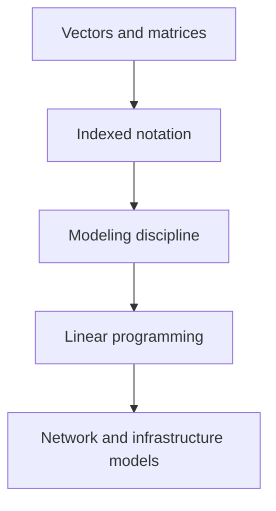

# Foundations

The foundation layer establishes the mathematical language used by all later optimization models.

Core topics:

- linear algebra,
- mathematical notation,
- mathematical modeling,
- linear programming.
