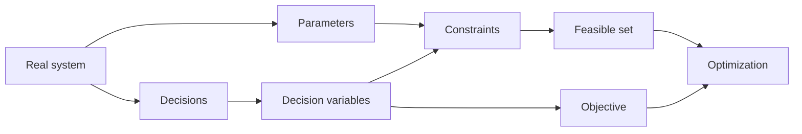

# Mathematical Modeling Framework

A deterministic optimization model converts a physical or managerial system into a mathematical decision problem.

## Four questions

| Component | Question |
|---|---|
| Input data | What is known before solving? |
| Decision variables | What can the decision-maker choose? |
| Constraints | What rules or physical limits must hold? |
| Objective | What quantity should be minimized or maximized? |

## Modeling pipeline



## Generic deterministic model

```math
\begin{aligned}
\min_x\quad & f(x)\\
\text{s.t.}\quad
& g_r(x)\le b_r,\qquad \forall r\in\mathcal R,\\
& h_q(x)=0,\qquad \forall q\in\mathcal Q,\\
& x\in\mathcal X.
\end{aligned}
```

The model is not complete until the domain $\mathcal X$ is stated.
