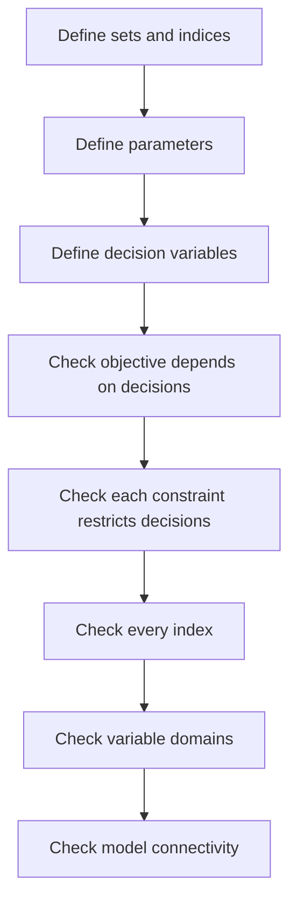

# Mathematical Formulation Audit

Use this audit before accepting any optimization model.



## Audit rules

1. **No undefined symbols.**
2. **No dangling indices.**
3. **The objective must depend on decision variables.**
4. **Each meaningful constraint must restrict decision variables.**
5. **Variable families should be linked when the physical system links them.**
6. **Aggregate nonnegativity is not componentwise nonnegativity.**
7. **Units must be dimensionally consistent.**

For example,

```math
\sum_{i=1}^{n}\sum_{j=1}^{m}x_{ij}\ge0
```

does not imply

```math
x_{ij}\ge0,\qquad\forall i\in[n],\ \forall j\in[m].
```
