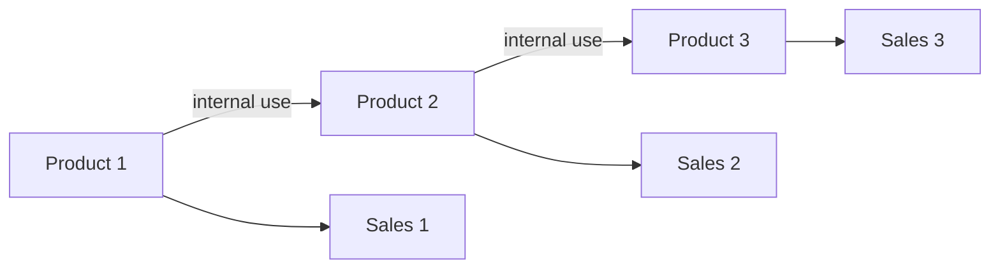

# Multi-Stage Production Flow

A production chain is naturally modeled by conservation or balance equations.



## Parameters

For $i\in[3]$,

```math
p_i=\text{selling price of product }i,
```

```math
a_i=\text{labor required per unit of product }i.
```

Let $b_2$ denote the units of Product 1 required per unit of Product 2, and $b_3$ the units of Product 2 required per unit of Product 3.

## Decision variables

```math
x_i=\text{units of product }i\text{ manufactured},
```

```math
s_i=\text{units of product }i\text{ sold}.
```

## Flow balances

```math
x_1=s_1+b_2x_2,
```

```math
x_2=s_2+b_3x_3,
```

```math
x_3=s_3.
```

## Labor capacity

```math
a_1x_1+a_2x_2+a_3x_3\le m.
```

## Revenue objective

```math
\max\quad p_1s_1+p_2s_2+p_3s_3.
```

The reusable engineering principle is

```math
\text{production}=\text{external sale}+\text{internal consumption}.
```
