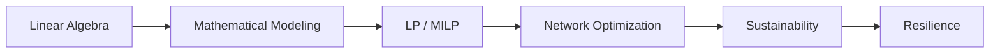
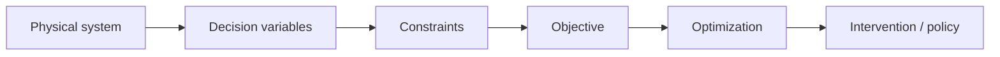

# Optimization for Sustainability and Resilience

A developing mathematical and computational repository for **optimization of sustainable and resilient engineering systems**.

The repository is organized around one intellectual progression:



and one engineering workflow:



## Mathematical viewpoint

A generic optimization model has the form

```math
\begin{aligned}
\min_{x\in\mathcal X}\quad & f(x)\\
\text{s.t.}\quad
& g_i(x)\le b_i,\qquad i\in[m],\\
& h_j(x)=0,\qquad j\in[p].
\end{aligned}
```

The same structure can represent cost, emissions, service loss, recovery time, robustness, or resilience.

## Repository map

| Area | Purpose |
|---|---|
| `01-foundations/` | Linear algebra, notation, modeling, LP foundations |
| `02-models/` | Reusable optimization model families |
| `03-sustainability/` | Environmental, economic, and social objectives |
| `04-resilience/` | Service loss, recovery, robustness, interdependence |
| `05-case-studies/` | Power, water, transport, and coupled systems |
| `coursework/IEE574/` | Course-aligned learning notes without publishing an answer key |
| `figures/` | TikZ and mathematical visualization assets |
| `notebooks/` | Julia and Python computational verification |
| `mindmaps/` | Xmind-importable Markdown maps |
| `references/` | Reading lists and bibliography |
| `tools/openai-platform/` | Optional future AI-assisted research workflow notes |

## Modeling standard

Every model should declare, in this order:

1. **Sets and indices**
2. **Parameters / input data**
3. **Decision variables**
4. **Objective**
5. **Constraints**
6. **Variable domains**
7. **Units and interpretation**
8. **Verification checks**

This mirrors the engineering logic:

```math
\text{data}\rightarrow\text{decisions}\rightarrow\text{rules}\rightarrow\text{goal}.
```

## Mathematical writing standard

- Inline mathematics uses LaTeX, e.g. $x\in\mathbb R^n$.
- Display mathematics is written as rendered GitHub math blocks.
- Every index is either summed over or explicitly quantified.
- Parameters and decision variables are never mixed conceptually.
- Every constraint receives a physical interpretation.
- Dimensional consistency is checked whenever units are present.

## Academic integrity

This is a **public** repository. During an active course, graded homework solutions should not be published before submission or when prohibited by course policy. The `coursework/` directory therefore stores study structure, notation, and reusable principles rather than a public answer key.

## Status

**Phase 1:** deterministic operations-research foundations.  
**Next:** network flow, sustainability objectives, resilience metrics, and coupled infrastructure models.
