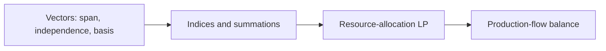

# Homework 1 — Learning Map

This public directory intentionally avoids publishing a complete graded answer key.

The reusable conceptual progression is:

The corresponding reusable notes live in:

- `01-foundations/linear-algebra/`
- `01-foundations/mathematical-notation/`
- `01-foundations/mathematical-modeling/`
- `02-models/resource-allocation/`
- `02-models/production-flow/`
