# 01 — Hierarchical Knowledge Map

**Purpose:** organize the repository from foundational mathematics to engineering intervention.

```mermaid
flowchart TD
    R["Optimization for Sustainability and Resilience"]

    R --> M["Mathematical Foundations"]
    R --> O["Optimization Theory"]
    R --> P["Physical Infrastructure"]
    R --> S["Sustainability"]
    R --> Q["Resilience"]
    R --> D["Decision and Intervention"]

    M --> M1["Linear Algebra"]
    M --> M2["Indexed Notation"]
    M --> M3["Convexity and Geometry"]
    M --> M4["Graph Theory"]

    O --> O1["Linear Programming"]
    O --> O2["Mixed-Integer Programming"]
    O --> O3["Network Optimization"]
    O --> O4["Multi-objective Optimization"]
    O --> O5["Robust / Stochastic Optimization"]

    P --> P1["Power"]
    P --> P2["Water"]
    P --> P3["Transportation"]
    P --> P4["Coupled Infrastructure"]

    S --> S1["Economic"]
    S --> S2["Environmental"]
    S --> S3["Social / Service"]

    Q --> Q1["Robustness"]
    Q --> Q2["Service Loss"]
    Q --> Q3["Recovery"]
    Q --> Q4["Interdependence"]

    D --> D1["Design"]
    D --> D2["Operation"]
    D --> D3["Restoration"]
    D --> D4["Policy / Planning"]
```



## Mathematical reading

The hierarchy should be read as a knowledge organization, not as a causal chain. It answers:

```math
\text{What concepts belong where?}
```

Use it when navigating the repository or planning what to learn next.
