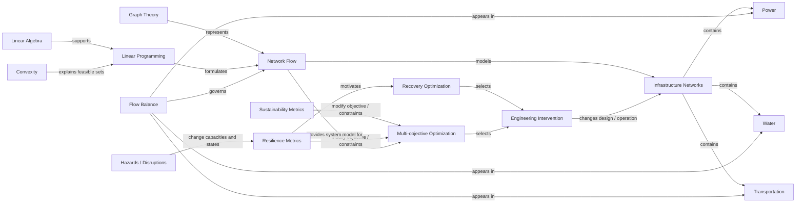

# 02 — Concept Map

**Purpose:** show how mathematical, optimization, sustainability, resilience, and infrastructure concepts relate to one another.



## Key conceptual relation

```math
\text{physical system}
\longrightarrow
\text{mathematical abstraction}
\longrightarrow
\text{optimization model}
\longrightarrow
\text{decision}.
```

Unlike a hierarchy, this representation deliberately permits cross-links and feedback.
