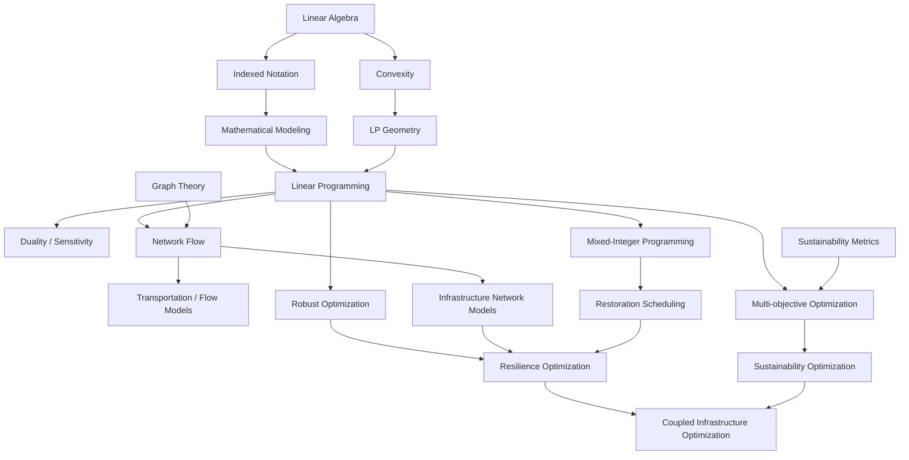

# 03 — Mathematical Dependency Graph

**Purpose:** show prerequisite relationships among the mathematical and optimization topics.



## Interpretation

An arrow

```math
A\rightarrow B
```

means that understanding or implementing $B$ substantially depends on concepts developed in $A$. This is a learning and model-development dependency graph, not a claim that each topic has only one prerequisite.
