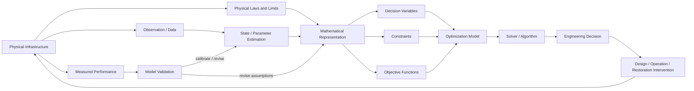

# 04 — Systems Engineering Architecture

**Purpose:** represent the full engineering loop from the physical system to intervention and validation.



## Core mathematical object

```math
\begin{aligned}
\min_{x\in\mathcal X}\quad & f(x;\theta)\\
\text{s.t.}\quad & g(x;\theta)\le 0,\\
& h(x;\theta)=0,
\end{aligned}
```

where $x$ denotes decisions and $\theta$ represents physical, economic, environmental, or operational parameters inferred from the system.

This diagram answers: **How does a real engineering system become an auditable optimization decision?**
