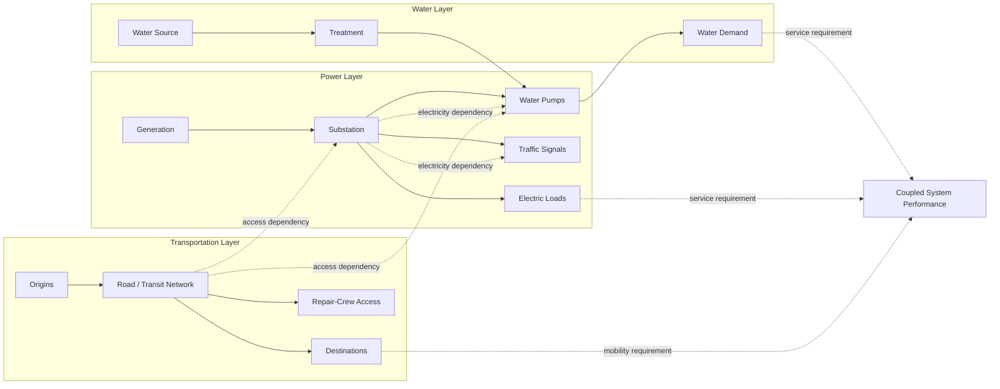

# 05 — Multilayer Interdependent Infrastructure Network

**Purpose:** represent power, water, and transportation as distinct physical layers connected by explicit cross-sector dependencies.



## Multilayer graph abstraction

A coupled system may be represented as

```math
\mathcal G=\left(\mathcal V,\mathcal E,\mathcal E^{\mathrm{coup}}\right),
```

with

```math
\mathcal V=\mathcal V_P\cup\mathcal V_W\cup\mathcal V_T,
```

where $\mathcal E$ contains within-layer connections and $\mathcal E^{\mathrm{coup}}$ contains cross-layer dependencies.

The scientific requirement is that each coupling edge be given an explicit physical interpretation, direction, units, and mathematical effect on the feasible set or system dynamics.
