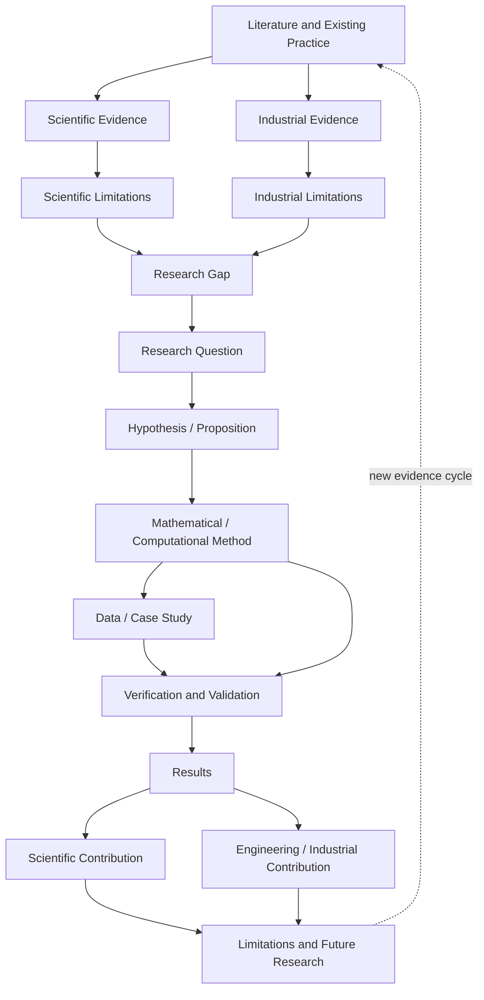

# 06 — Research-Gap Map

**Purpose:** connect evidence, limitations, research questions, methods, validation, and contribution.



## Research logic

```math
\text{evidence}
\rightarrow
\text{limitation}
\rightarrow
\text{gap}
\rightarrow
\text{question}
\rightarrow
\text{method}
\rightarrow
\text{validation}
\rightarrow
\text{contribution}.
```

A rigorous gap must be supported by evidence; it should not be created merely because a method is mathematically interesting.
