# 07 — Computational Optimization Workflow

**Purpose:** make the modeling-to-results pipeline reproducible and auditable.

```mermaid
flowchart LR
    A["Problem Definition"] --> B["Data and Assumptions"]
    B --> C["Mathematical Formulation"]
    C --> D["Symbol / Unit / Index Audit"]
    D --> E["Implementation"]
    E --> F["Solver Execution"]
    F --> G["Feasibility Verification"]
    G --> H["Optimality / Sanity Checks"]
    H --> I["Sensitivity / Scenario Analysis"]
    I --> J["Visualization"]
    J --> K["Engineering Interpretation"]
    K --> L["Documentation and Version Control"]
    L -. "revision" .-> B
```



## Required verification logic

```math
x^*\in\mathcal F
```

must be checked before interpreting the objective value, where

```math
\mathcal F=\{x:g(x)\le0,\ h(x)=0,\ x\in\mathcal X\}.
```

A numerical solver output is evidence only after the formulation, units, feasibility, and implementation have been independently checked.
