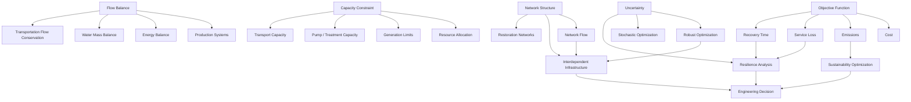

# 08 — Cross-Domain Knowledge Graph

**Purpose:** show reusable mathematical ideas that connect multiple optimization and infrastructure domains.



## Why this graph matters

The same mathematical primitive can appear in several engineering contexts. For example,

```math
\text{flow balance}
```

is not specific to one sector; it is a transferable conservation structure that reappears in production, energy, water, and transportation models.
