# 09 — Radial Research Map

**Purpose:** provide a central-topic view for brainstorming and rapid navigation.

> GitHub does not guarantee a true radial layout for every Mermaid renderer, so this uses a center-node graph that remains GitHub-native and reproducible.

```mermaid
flowchart TD
    C(("Optimization for Sustainability and Resilience"))

    C --- A["Mathematics"]
    C --- B["Optimization"]
    C --- D["Physical Systems"]
    C --- E["Sustainability"]
    C --- F["Resilience"]
    C --- G["Computation"]
    C --- H["Research"]
    C --- I["Engineering Decisions"]

    A --> A1["Linear Algebra"]
    A --> A2["Graph Theory"]
    A --> A3["Convexity"]

    B --> B1["LP / MILP"]
    B --> B2["Network Optimization"]
    B --> B3["Robust / Multi-objective"]

    D --> D1["Power"]
    D --> D2["Water"]
    D --> D3["Transportation"]

    E --> E1["Economic"]
    E --> E2["Environmental"]
    E --> E3["Social"]

    F --> F1["Robustness"]
    F --> F2["Recovery"]
    F --> F3["Service Continuity"]

    G --> G1["Julia"]
    G --> G2["Python"]
    G --> G3["LaTeX / TikZ"]

    H --> H1["Literature"]
    H --> H2["Research Gaps"]
    H --> H3["Validation"]

    I --> I1["Design"]
    I --> I2["Operation"]
    I --> I3["Restoration"]
```

This view is best used for ideation; more rigorous causal or prerequisite relations are represented in the concept and dependency graphs.
