# 10 — Learning and Research Roadmap

**Purpose:** show progression from current IEE 574 foundations toward advanced sustainability and resilience optimization.

```mermaid
flowchart LR
    A["Stage 1\nLinear Algebra + Notation"] --> B["Stage 2\nMathematical Modeling"]
    B --> C["Stage 3\nLinear Programming"]
    C --> D["Stage 4\nLP Geometry + Sensitivity"]
    D --> E["Stage 5\nNetwork Flow + Transportation"]
    E --> F["Stage 6\nMILP + Scheduling"]
    F --> G["Stage 7\nMulti-objective Sustainability"]
    G --> H["Stage 8\nRobust / Stochastic Optimization"]
    H --> I["Stage 9\nResilience + Recovery"]
    I --> J["Stage 10\nInterdependent Infrastructure"]
    J --> K["Stage 11\nPower-Water-Transportation Case Studies"]
```



## Progression principle

```math
\text{mathematical language}
\rightarrow
\text{model formulation}
\rightarrow
\text{optimization theory}
\rightarrow
\text{network systems}
\rightarrow
\text{sustainability}
\rightarrow
\text{resilience}.
```

This roadmap should evolve as the repository gains new models and case studies.
