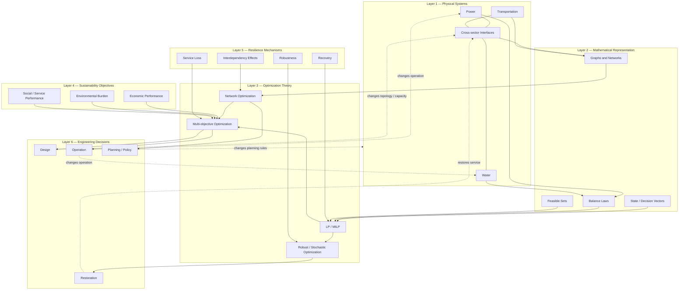

# 11 — Hybrid Scientific Architecture

**Purpose:** integrate mathematics, physical systems, optimization, sustainability, resilience, and engineering intervention into one research architecture.



## Formal interpretation

Let

```math
x\in\mathcal X
```

denote engineering decisions, $\theta$ physical and operational parameters, and $\omega$ uncertain disturbances. A generic coupled formulation is

```math
\begin{aligned}
\min_{x\in\mathcal X}\quad
& \Big(C(x),\ E(x),\ L(x,\omega)\Big)\\
\text{s.t.}\quad
& F_P(x,\theta,\omega)=0,\\
& F_W(x,\theta,\omega)=0,\\
& F_T(x,\theta,\omega)=0,\\
& H_{PWT}(x,\theta,\omega)\le 0,
\end{aligned}
```

where $F_P,F_W,F_T$ represent sector-specific physical or operational constraints and $H_{PWT}$ represents cross-sector coupling constraints.

The architecture is intentionally cyclic:

```math
\text{physical system}
\rightarrow
\text{model}
\rightarrow
\text{optimization}
\rightarrow
\text{intervention}
\rightarrow
\text{changed physical system}.
```

This is the master scientific systems map for the repository.
