# 12 — Full Thesis Logic Mind Map

**Central theme:** Coupled Power–Transportation Infrastructure Resilience  
**Interpretation:** System of Systems architecture + complex dynamical behavior  
**Status:** GitHub-native visual decomposition of the canonical thesis framework  
**Authority rule:** this map does **not** replace the frozen seven-stage framework in [`04-resilience/FINAL_FRAMEWORK.md`](../../04-resilience/FINAL_FRAMEWORK.md) or the canonical interdependency definition in [`02-models/canonical-interdependency-object.md`](../../02-models/canonical-interdependency-object.md).

---

## Master mind map

```mermaid
%%{init: {"flowchart": {"htmlLabels": true, "curve": "basis", "nodeSpacing": 24, "rankSpacing": 65}}}%%
flowchart LR
    C["COUPLED POWER–TRANSPORTATION<br/>INFRASTRUCTURE RESILIENCE<br/><br/>System of Systems architecture<br/>+ complex dynamical behavior"]

    B1["1. Foundational Reasoning"]
    B2["2. System Architecture"]
    B3["3. Physical Layer"]
    B4["4. Support Layer"]
    B5["5. Interdependency Object"]
    B6["6. Coupled Dynamics"]
    B7["7. Resilience"]
    B8["8. Service & State Sets"]
    B9["9. Intervention"]
    B10["10. Sustainability Consequences"]
    B11["11. Engineering Decision"]
    B12["12. Research Hypotheses"]
    B13["13. Houston Demonstrator"]
    B14["14. Final Thesis Flow"]

    C --> B1
    C --> B2
    C --> B3
    C --> B4
    C --> B5
    C --> B6
    C --> B7
    C --> B8
    C --> B9
    C --> B10
    C --> B11
    C --> B12
    C --> B13
    C --> B14

    B1 --> B1A["Systems Thinking / Iceberg<br/>Events → Patterns → Structures → Rules"]
    B1 --> B1B["Systems Engineering<br/>Need → Requirements → Architecture → Interfaces → Models → V&V → Decision"]

    B2 --> B2A["Physical layer<br/>P + T"]
    B2 --> B2B["Support layer<br/>I + O"]
    B2 --> B2C["SoS = architecture<br/>Complex system = behavior"]

    B3 --> B3A["Power intra-network<br/>G_P=(V_P,E_P,Φ_P)<br/>buses • lines/feeders • transformers • switches • loads • DER<br/>states: V, P/Q, loading, operation, damage"]
    B3 --> B3B["Transportation intra-network<br/>G_T=(V_T,E_T,Φ_T)<br/>intersections • road links • signals • OD pairs • routes<br/>states: flow, capacity, travel time, congestion, passability"]
    B3 --> B3C["Meso / interface mechanisms M_PT<br/>traffic signals • repair access<br/>extensions: charging • traction • mobile resources"]
    B3 --> B3D["Bidirectional dependencies<br/>P→T: signal power, charging, traction<br/>T→P: repair access, demand, V2G, mobile resources"]
    B3 --> B3E["Interdependency geometry<br/>node→node • node→edge • edge→node<br/>edge→edge • path→node"]
    B3 --> B3F["Hazard forcing η(x,t)<br/>flood depth • extent • exposure<br/>GUARDRAIL: common hazard ≠ interdependency"]

    B4 --> B4A["Information I = KNOW<br/>sensing • monitoring • communication • data<br/>state estimation • uncertainty<br/>y_t → Ŷ_t"]
    B4 --> B4B["Organization O<br/>authority • coordination • crews • resources<br/>priority rules • response timing"]
    B4 --> B4C["Feasible action<br/>u_t ∈ U(z_I,z_O)"]

    B5 --> B5A["Canonical object<br/>𝕴_ij^(αβ)=(E_i^α,E_j^β,M_ij,w_ij,δ_ij,τ_ij,a_ij,m,H_t)"]
    B5 --> B5B["Semantics<br/>entities • mechanism • strength • delay<br/>timescale • activation • mode • history"]
    B5 --> B5C["Representation discipline<br/>direction = ordered source/receiver<br/>spatial relation = graph/geometry metadata<br/>evidence = provenance metadata"]

    B6 --> B6A["Physical substate<br/>X_phys=[x_P ; x_T]"]
    B6 --> B6B["Full state and dynamics<br/>Y=[x_P ; x_T ; z_I ; z_O]<br/>Ẏ = F_G(Y,Z_PT,u,η;θ,𝕴)"]
    B6 --> B6C["Emergent behavior<br/>cascades • feedback • nonlinearity • thresholds<br/>path dependence • spatial propagation • recovery"]

    B7 --> B7A["Conventional metrics<br/>performance loss • resilience curve • recovery time"]
    B7 --> B7B["Thesis operationalization<br/>viability • reachability • probabilistic confidence<br/>not a literal algebraic sum"]
    B7 --> B7C["Questions<br/>remain acceptable? • recoverable?<br/>how fast? • with what confidence?"]

    B8 --> B8A["Acceptable set<br/>K = K_phys ∩ K_svc ∩ K_op"]
    B8 --> B8B["State partition<br/>K acceptable • D degraded • F failure<br/>G_rec recovery target"]
    B8 --> B8C["Set relation<br/>D = K^c ∖ F<br/>provided F ⊆ K^c"]

    B9 --> B9A["Diagnosis<br/>critical components • critical interfaces<br/>recovery bottlenecks"]
    B9 --> B9B["Actions<br/>switching • signal backup • route management<br/>repair sequencing • hardening • resource deployment"]
    B9 --> B9C["Effect<br/>a_k → Δℜ"]

    B10 --> B10A["Sustainability vector<br/>J_sus=[J_access,J_energy,J_carbon,J_cost]^T"]
    B10 --> B10B["Consequences<br/>accessibility • energy • carbon • cost"]
    B10 --> B10C["Systems test<br/>trade-offs • burden shifting • unintended effects"]

    B11 --> B11A["Resilience-only optimum<br/>A_R*"]
    B11 --> B11B["Joint resilience–sustainability optimum<br/>A_R,S*"]
    B11 --> B11C["Decision question<br/>Which intervention is admissible under uncertainty<br/>for both resilience and sustainability criteria?"]

    B12 --> B12A["H1 — Coupling representation<br/>M2 dynamic vs M1 static vs M0 independent"]
    B12 --> B12B["H2 — Layer completeness<br/>P+T vs P+T+I vs P+T+I+O"]
    B12 --> B12C["H3 — Resilience representation<br/>curve metrics vs viability/reachability augmentation"]
    B12 --> B12D["H4 — Intervention consequences<br/>a_k → (Δℜ, ΔJ_sus)"]
    B12 --> B12E["H5 — Joint decision<br/>A_R* vs A_R,S*"]

    B13 --> B13A["Physical systems<br/>SMART-DS power + H-GAC roads"]
    B13 --> B13B["Hazard<br/>Hurricane Harvey flooding"]
    B13 --> B13C["Primary interfaces<br/>P→T: traffic-signal power<br/>T→P: repair-crew access"]
    B13 --> B13D["BOUNDARY<br/>Houston demonstrator ≠ full theoretical framework"]

    B14 --> B14A["Need → Structure → Interdependency → Dynamics<br/>→ Observation/Control → Resilience → Intervention<br/>→ Sustainability → Decision"]
    B14 --> B14B["Canonical 7-stage backbone<br/>Structure → Causal Mechanisms → Hybrid Multiscale Dynamics<br/>→ Feedback & Control → Viability → R→S Interface → Pathways"]
    B14 --> B14C["Interpretation rule<br/>14 branches = decomposition for reasoning and communication<br/>7 stages = authoritative thesis architecture"]

    classDef central fill:#111111,stroke:#D4AF37,color:#FFFFFF,stroke-width:4px;
    classDef main fill:#2A2A2A,stroke:#D4AF37,color:#FFFFFF,stroke-width:2px;
    classDef child fill:#FFFFFF,stroke:#4A4A4A,color:#111111,stroke-width:1px;
    classDef guard fill:#FFF7DB,stroke:#B58A00,color:#111111,stroke-width:2px;
    classDef test fill:#F4E7B2,stroke:#8A6A00,color:#111111,stroke-width:2px;

    class C central;
    class B1,B2,B3,B4,B5,B6,B7,B8,B9,B10,B11,B12,B13,B14 main;
    class B1A,B1B,B2A,B2B,B2C,B3A,B3B,B3C,B3D,B3E,B4A,B4B,B4C,B5A,B5B,B5C,B6A,B6B,B6C,B7A,B7B,B7C,B8A,B8B,B8C,B9A,B9B,B9C,B10A,B10B,B10C,B11A,B11B,B11C,B12A,B12B,B12C,B12D,B12E,B13A,B13B,B13C,B14A,B14B,B14C child;
    class B3F,B13D guard;
    class B12A,B12B,B12C,B12D,B12E test;

    linkStyle 0,1,2,3,4,5,6,7,8,9,10,11,12,13 stroke:#D4AF37,stroke-width:2.5px;
```



---

## Mathematical anchors

The visual uses concise notation in Mermaid. The exact mathematical reading is the following.

### 1. Multilayer architecture

```math
\boxed{\mathcal S=\{P,T,I,O\}},
\qquad
\underbrace{P,T}_{\text{physical}},
\qquad
\underbrace{I,O}_{\text{support / cognitive-control layers}}.
```

The architecture/behavior distinction is:

```math
\boxed{\text{System of Systems}=\text{architecture}},
\qquad
\boxed{\text{complex system}=\text{emergent dynamical behavior}}.
```

### 2. Physical networks

```math
\mathcal G_P=(V_P,E_P,\Phi_P),
\qquad
\mathcal G_T=(V_T,E_T,\Phi_T).
```

The inter-system dependency set is

```math
\boxed{
\mathbb I_{PT}
=
\mathbb I_{P\rightarrow T}
\cup
\mathbb I_{T\rightarrow P}
}.
```

The external hazard field acts on system components through exposure/vulnerability mechanisms:

```math
\eta(x,t)\rightarrow P,T,
```

but

```math
\boxed{\text{common hazard}\neq\text{interdependency}}.
```

### 3. Canonical interdependency object

For every intra- or inter-layer coupling,

```math
\boxed{
\mathfrak I_{ij}^{\alpha\beta}
=
\left(
E_i^\alpha,
E_j^\beta,
M_{ij},
w_{ij},
\delta_{ij},
\tau_{ij},
a_{ij},
m,
\mathcal H_t
\right)
}.
```

Scientific bookkeeping is separated from the mathematical tuple:

- **direction** is encoded by the ordered pair \((E_i^\alpha,E_j^\beta)\);
- **spatial relation** belongs to the graph embedding / geometry of the participating entities unless explicitly promoted to a model variable;
- **availability/activation** is represented by \(a_{ij}\);
- **evidence/provenance** is attached to the claim/object as metadata and should not be confused with a dynamical state variable.

### 4. State hierarchy and coupled dynamics

Physical state:

```math
X_{\rm phys}(t)
=
\begin{bmatrix}
x_P(t)\\
x_T(t)
\end{bmatrix}.
```

Full P–T–I–O state:

```math
\boxed{
Y(t)
=
\begin{bmatrix}
x_P(t)\\
x_T(t)\\
z_I(t)\\
z_O(t)
\end{bmatrix}
}.
```

A thesis-level controlled coupled model is therefore written as

```math
\boxed{
\dot Y(t)
=
F_{\mathcal G}
\left(
Y(t),
Z_{PT}(t),
u(t),
\eta(t);
\theta,
\mathbb I(t)
\right)
},
```

with feasible intervention constrained by information and organizational state:

```math
\boxed{
u(t)\in\mathcal U\!\left(z_I(t),z_O(t)\right)}.
```

Here \(Z_{PT}\) collects interface states. In a hybrid model, discrete jumps/mode changes are added explicitly rather than hidden inside a purely continuous equation.

### 5. Acceptable, degraded and failed states

```math
\boxed{
K
=
K_{\rm phys}
\cap
K_{\rm svc}
\cap
K_{\rm op}
}.
```

If the failure set is defined outside the acceptable set, \(F\subseteq K^c\), then

```math
\boxed{D=K^c\setminus F}.
```

A recovery target is denoted \(G_{\rm rec}\).

### 6. Resilience operationalization

The phrase

```math
\text{Viability} + \text{Reachability} + \text{Probability}
```

is treated as a **conceptual decomposition**, not a literal scalar addition. A mathematically safer thesis-level representation is

```math
\boxed{
\mathfrak R_T
=
\Psi\!\left(
\mathcal V_T,
\mathcal R_T,
\mathbb P_{\pi}
\right)
},
```

where \(\mathcal V_T\) is the finite-horizon viable set, \(\mathcal R_T\) a recovery/reachability object, and \(\mathbb P_{\pi}\) the probability measure induced under an admissible policy \(\pi\). The exact functional \(\Psi\) must be defined by the selected resilience metric rather than assumed.

### 7. Sustainability consequences

```math
\boxed{
\mathbf J_{\rm sus}
=
\begin{bmatrix}
J_{\rm access}\\
J_{\rm energy}\\
J_{\rm carbon}\\
J_{\rm cost}
\end{bmatrix}
}.
```

For an intervention \(a_k\), evaluate both resilience and sustainability effects:

```math
\boxed{
a_k
\longrightarrow
\left(
\Delta\mathfrak R,
\Delta\mathbf J_{\rm sus}
\right)
}.
```

### 8. Engineering decision

The comparison is between a resilience-only admissible decision set/optimum and a joint resilience–sustainability decision:

```math
\boxed{
\mathcal A_R^\star
\quad\text{vs}\quad
\mathcal A_{R,S}^\star
}.
```

The engineering question is:

> Which intervention satisfies the required resilience constraints and produces acceptable sustainability consequences under modeled uncertainty?

---

## Research hypotheses encoded in the map

| Hypothesis | Controlled comparison | Scientific purpose |
|---|---|---|
| **H1** | \(M_2\) dynamic coupling vs \(M_1\) static coupling vs \(M_0\) independent networks | Test whether time-varying interdependency representation materially changes propagation, service loss, viability, or recovery inference. |
| **H2** | \(P+T\) vs \(P+T+I\) vs \(P+T+I+O\) | Quantify the incremental explanatory/decision value of information and organizational states. |
| **H3** | Conventional resilience curves vs viability/reachability augmentation | Test whether state-space survival/recovery analysis reveals distinctions hidden by aggregate performance curves. |
| **H4** | \(a_k\mapsto(\Delta\mathfrak R,\Delta\mathbf J_{\rm sus})\) | Test whether resilience-improving interventions create co-benefits, trade-offs, or burden shifting. |
| **H5** | \(\mathcal A_R^\star\) vs \(\mathcal A_{R,S}^\star\) | Test whether explicitly accounting for sustainability changes the preferred feasible intervention set or decision. |

These are **test structures**, not assumed results. Effect sizes, statistical criteria, uncertainty treatment, and falsification thresholds must be specified in the experiment design.

---

## Houston demonstrator boundary

The demonstrator instantiates only a defensible subset of the general framework:

```math
\boxed{
\text{SMART-DS power}
+
\text{H-GAC road network}
+
\text{Harvey flood forcing}
+
\{P\rightarrow T:\text{signal power},\;T\rightarrow P:\text{repair access}\}
}.
```

Therefore,

```math
\boxed{\text{Houston demonstrator}\neq\text{full theoretical framework}}.
```

Extensions such as EV charging, V2G, traction power, mobile generation and other interface classes remain part of the broader theory unless and until the demonstrator includes evidence and data sufficient to instantiate them.

---

## Crosswalk: 14-branch map → canonical seven-stage framework

| Mind-map content | Canonical role |
|---|---|
| **1. Foundational Reasoning** | Pre-model reasoning discipline: systems thinking + systems engineering |
| **2–4. Architecture, Physical, Support layers** | **Stage 1 — Multilayer Structure** |
| **3.3–3.5 + 5. Interdependency mechanisms/object** | **Stage 2 — Causal Mechanisms** |
| **3.6 Hazard + 6. Coupled Dynamics** | **Stage 3 — Coupled Hybrid Multiscale Dynamics** |
| **4. Support Layer + 9. Intervention** | **Stage 4 — Feedback & Control** |
| **7. Resilience + 8. Service/State Sets** | **Stage 5 — Viability** and recovery/reachability analysis |
| **10. Sustainability Consequences** | **Stage 6 — Resilience-to-Sustainability Transformation Interface** |
| **11. Engineering Decision** | **Stage 7 — Sustainable Transformation Pathways / decision** |
| **12. Hypotheses** | Cross-stage falsification and ablation structure |
| **13. Houston Demonstrator** | Empirical/computational instantiation and validation boundary |
| **14. Final Thesis Flow** | Synthesis of the full reasoning chain |

The governing architecture therefore remains

```math
\boxed{
\text{Multilayer Structure}
\rightarrow
\text{Causal Mechanisms}
\rightarrow
\text{Coupled Hybrid Multiscale Dynamics}
\rightarrow
\text{Feedback \& Control}
\rightarrow
\text{Viability}
\rightarrow
\text{Resilience-to-Sustainability Transformation Interface}
\rightarrow
\text{Sustainable Transformation Pathways}
}.
```

while the full communication/reasoning flow is

```math
\boxed{
\text{Need}
\rightarrow
\text{Structure}
\rightarrow
\text{Interdependency}
\rightarrow
\text{Dynamics}
\rightarrow
\text{Observation/Control}
\rightarrow
\text{Resilience}
\rightarrow
\text{Intervention}
\rightarrow
\text{Sustainability}
\rightarrow
\text{Decision}
}.
```

---

## Reading rule

This mind map is deliberately hierarchical. It answers:

```math
\boxed{\text{What is the complete thesis logic, and where does each object belong?}}
```

It should be used together with the causal maps, dependency graphs, system architecture, computational workflow, and canonical framework rather than interpreted as a substitute for them.
